# AIDATA 3D 耦合炼丹执行计划

> 计划版本: v1.0  
> 生成时间: 2026-01-29 08:45  
> 负责人: 蛇仔 (MiniMax-M2.1 模型)  
> 状态: 执行中

---

## 目录

1. [项目概述](#1-项目概述)
2. [现状分析](#2-现状分析)
3. [执行目标](#3-执行目标)
4. [任务分解](#4-任务分解)
5. [时间线](#5-时间线)
6. [技术方案](#6-技术方案)
7. [风险与应对](#7-风险与应对)
8. [验收标准](#8-验收标准)

---

## 1. 项目概述

### 1.1 背景
基于之前的任务日志，我们已经成功：
- 生成了 24,000+ 个 MilkDrop 预设
- 实现了 3D 耦合预设生成 (3,000 对 FG/BG)
- 完成了 AI 团队分析和计划制定

### 1.2 当前问题
- 现有炼丹产物未完全整合到 newliveweb 项目
- 3D 耦合效果需要进一步优化和测试
- 需要系统化的持续生成和验证流程

### 1.3 解决方案
1. **优化现有炼丹脚本** - 基于 D:\aidata 的高质量数据
2. **集成到项目** - 将预设整合到 newliveweb 的预设系统
3. **实现持续生成** - 建立自动化炼丹流水线
4. **测试与验证** - 在项目中测试 3D 耦合效果

---

## 2. 现状分析

### 2.1 现有炼丹产物
| 目录 | 数量 | 质量 | 状态 |
|------|------|------|------|
| ai_generated/ | 6,800 | 17行基础 | ✅ 完成 |
| ai_generated_quality/ | 1,000 | 77行完整 | ✅ 完成 |
| ai_generated_premium/ | 10,000 | 200行+shapecode | ✅ 完成 |
| ai_generated_v2/ | 5,000 | 200行高质量 | ✅ 完成 |
| ai_generated_coupled/ | 500对 | 3D耦合 | ✅ 完成 |
| ai_generated_coupled_final/ | 3,000对 | 高质量3D耦合 | ✅ 完成 |

**总计**: 24,000+ 个预设，3,500 对耦合预设

### 2.2 项目集成状态
- ✅ 已有完整的 3D 耦合实施计划文档
- ⚠️ 预设尚未整合到项目预设库
- ⚠️ 耦合算法需要与项目代码对接
- ⚠️ 缺少自动化验证流程

### 2.3 技术挑战
1. **性能优化**: 大量预设加载和切换的性能
2. **耦合算法**: 实现真正的 3D 空间干涉效果
3. **自动化**: 持续生成和验证的自动化流程
4. **集成**: 与现有项目架构的无缝集成

---

## 3. 执行目标

### 3.1 短期目标 (1-2天)
1. 优化现有炼丹脚本，生成更多高质量 3D 耦合预设
2. 将现有预设整合到 newliveweb 项目
3. 在项目中测试基础 3D 耦合效果

### 3.2 中期目标 (3-7天)
1. 实现自动化炼丹流水线
2. 优化 3D 耦合算法，增强视觉效果
3. 建立预设质量评估系统

### 3.3 长期目标 (1-2周)
1. 达到 10,000 对高质量 3D 耦合预设
2. 完全集成到项目生产环境
3. 实现智能预设推荐系统

---

## 4. 任务分解

### 阶段一：脚本优化与数据生成 (Day 1)

#### 任务 1.1：分析现有炼丹脚本
- 定位 D:\aidata 中的炼丹脚本
- 分析脚本结构和参数配置
- 识别优化点

#### 任务 1.2：优化 3D 耦合生成算法
- 基于现有耦合算法进行优化
- 增加更多耦合维度（颜色、运动、形状）
- 优化参数分布范围

#### 任务 1.3：批量生成高质量预设
- 生成 5,000 对新的 3D 耦合预设
- 确保参数多样性和视觉质量
- 生成统计数据和日志

### 阶段二：项目集成 (Day 2)

#### 任务 2.1：预设库整合
- 分析 newliveweb 预设系统架构
- 创建预设清单和元数据
- 将预设整合到项目预设目录

#### 任务 2.2：耦合算法对接
- 分析项目中的耦合机制
- 实现预设对的自动加载
- 测试耦合效果

#### 任务 2.3：性能优化
- 预设加载性能测试
- 内存使用优化
- 缓存策略实现

### 阶段三：自动化与验证 (Day 3-7)

#### 任务 3.1：自动化炼丹流水线
- 创建定时生成脚本
- 实现质量自动评估
- 建立错误处理和恢复机制

#### 任务 3.2：视觉质量验证
- 创建自动化测试套件
- 实现预设渲染验证
- 建立质量评分系统

#### 任务 3.3：文档与监控
- 更新技术文档
- 实现运行状态监控
- 创建性能报告系统

---

## 5. 时间线

```mermaid
gantt
    title AIDATA 3D 耦合炼丹执行时间线
    dateFormat  HH:mm
    axisFormat %H:%M
    
    section 阶段一：脚本优化
    分析现有脚本        :a1, 08:45, 30m
    优化耦合算法        :a2, after a1, 1h
    批量生成预设        :a3, after a2, 2h
    
    section 阶段二：项目集成
    预设库整合         :b1, after a3, 1h
    耦合算法对接       :b2, after b1, 1.5h
    性能优化          :b3, after b2, 1h
    
    section 阶段三：自动化
    自动化流水线       :c1, after b3, 2h
    视觉质量验证       :c2, after c1, 1.5h
    文档与监控         :c3, after c2, 1h
```



---

## 6. 技术方案

### 6.1 3D 耦合算法优化

#### 空间耦合增强
```python
# 增强的空间视差算法
def enhanced_spatial_coupling(base_value, pair_id, time):
    # 多层正弦波叠加产生复杂运动
    offset1 = 0.02 * sin(0.5 * time + pair_id * 0.3)
    offset2 = 0.01 * sin(1.2 * time + pair_id * 0.7)
    offset3 = 0.005 * sin(2.8 * time + pair_id * 1.2)
    return base_value + offset1 + offset2 + offset3
```

#### 颜色耦合
```python
# RGB 通道差异化耦合
def color_coupling(rgb_base, pair_id, time):
    # R, G, B 通道使用不同频率和相位
    r_offset = 0.1 * sin(0.3 * time + pair_id * 0.2)
    g_offset = 0.08 * sin(0.5 * time + pair_id * 0.5)
    b_offset = 0.06 * sin(0.7 * time + pair_id * 0.8)
    
    return (
        rgb_base[0] + r_offset,
        rgb_base[1] + g_offset,
        rgb_base[2] + b_offset
    )
```

### 6.2 预设集成方案

#### 预设清单格式
```json
{
  "preset_pairs": [
    {
      "id": "coupled_0001",
      "fg_preset": "ai_generated_coupled_final/fg/coupled_0001_fg.milk",
      "bg_preset": "ai_generated_coupled_final/bg/coupled_0001_bg.milk",
      "coupling_strength": 0.85,
      "spatial_offset": 0.057,
      "color_variance": 0.42,
      "quality_score": 0.92
    }
  ]
}
```

### 6.3 自动化流水线架构

```
┌─────────────────┐    ┌─────────────────┐    ┌─────────────────┐
│   数据生成      │───▶│   质量评估      │───▶│   项目集成      │
│   - 批量生成    │    │   - 视觉检查    │    │   - 预设入库    │
│   - 参数优化    │    │   - 参数验证    │    │   - 元数据更新  │
└─────────────────┘    └─────────────────┘    └─────────────────┘
         │                       │                       │
         └───────────────────────┼───────────────────────┘
                                 ▼
                         ┌─────────────────┐
                         │   监控报告      │
                         │   - 状态监控    │
                         │   - 性能报告    │
                         │   - 错误日志    │
                         └─────────────────┘
```

---

## 7. 风险与应对

### 风险 1：预设质量不一致
- **影响**: 视觉效果差，用户体验不佳
- **应对**: 
  - 实现多层质量检查
  - 建立预设评分系统
  - 人工抽样验证

### 风险 2：性能问题
- **影响**: 项目运行缓慢，内存占用高
- **应对**:
  - 实现预设懒加载
  - 优化内存管理
  - 建立性能监控

### 风险 3：集成复杂度高
- **影响**: 项目稳定性受影响
- **应对**:
  - 分阶段集成
  - 充分测试
  - 回滚机制

### 风险 4：自动化流程故障
- **影响**: 数据生成中断
- **应对**:
  - 实现错误恢复
  - 定期备份
  - 监控告警

---

## 8. 验收标准

### 8.1 数据生成验收
- [ ] 生成 5,000 对新的 3D 耦合预设
- [ ] 预设质量评分平均 ≥ 0.85
- [ ] 参数多样性覆盖所有关键维度
- [ ] 生成日志完整可追溯

### 8.2 项目集成验收
- [ ] 预设成功加载到 newliveweb 项目
- [ ] 3D 耦合效果可观察
- [ ] 性能指标在可接受范围内
- [ ] 用户界面操作流畅

### 8.3 自动化验收
- [ ] 自动化流水线正常运行
- [ ] 质量评估系统有效
- [ ] 监控报告准确及时
- [ ] 错误处理机制健全

### 8.4 文档验收
- [ ] 技术文档完整更新
- [ ] 操作指南清晰易懂
- [ ] 问题排查文档齐全
- [ ] 性能报告模板完善

---

## 开始执行

基于以上计划，我将立即开始执行阶段一的任务。首先定位和分析现有的炼丹脚本，然后优化算法并开始批量生成高质量的 3D 耦合预设。

**执行状态**: 🟢 开始执行
**当前阶段**: 阶段一 - 脚本优化与数据生成
**预计完成时间**: 今天内完成阶段一和阶段二

---
*文档版本: v1.0 | 最后更新: 2026-01-29 08:45 | 负责人: 蛇仔*